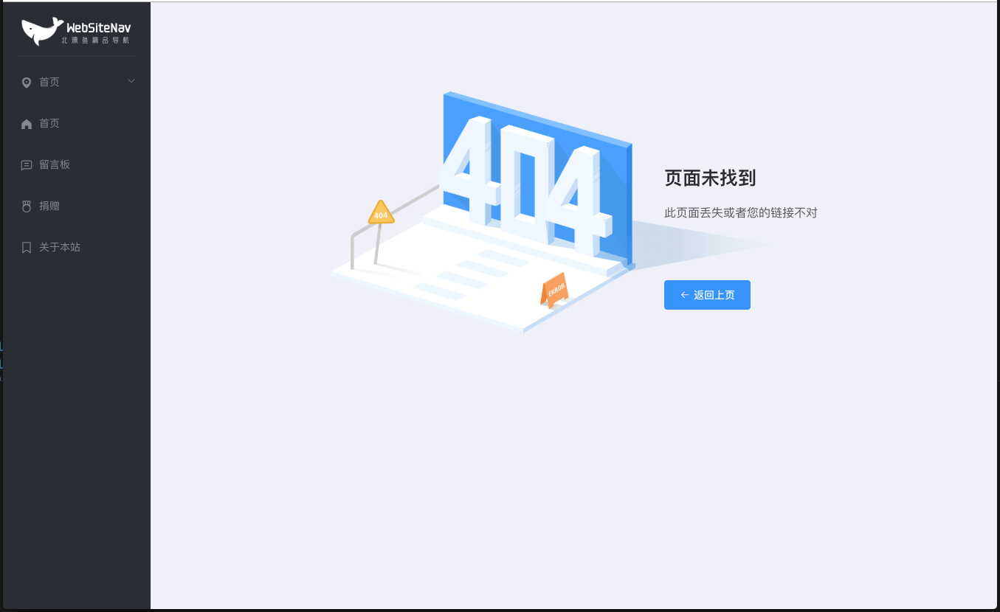

# WebsiteNav
<p align="center">
  <a href="https://github.com/vuejs/vue">
    
  </a>
  <a href="https://cli.vuejs.org">
    
  </a>
  <a href="https://github.com/ElemeFE/element">
    
  </a>
  <a href="LICENSE">
    
  </a>
  <a href="http://www.beipy.com">
    
  </a>
</p>

## 前言

基于Vue.js 3.x系列 + Element UI进行搭建的响应式网站导航。

开发暂开接口：https://www.easy-mock.com/mock/5cced2076573c22f8fc98313/example_copy/index

设置测试接口：https://www.easy-mock.com/mock/5cced2076573c22f8fc98313/example_copy/string

## 界面效果
-----


## 运行环境

#### 本地环境模拟

一键操作包PhpSudy <a href="http://phpstudy.php.cn/" target="_blank">点击下载</a>

1. 集成环境搭建: windows 上面建议用 phpstudy ,其它环境自行百度
2. 把文件放到网站根目录


## 功能 
- [] 管理员登录
- [] 登录
- [] 修改密码
- [] 角色管理
- [] 权限管理
- [x] 401/404错误页面
- [] 动态面包屑
- [] 动态侧边栏
- [x] Pc端自适应
- [] 广告管理
- [] 用户本地暂存数据

## 本地开发

	// 开启服务器，浏览器访问 http://localhost:8080
	npm run serve

## 安装依赖环境

	// 执行构建依赖环境命令
	npm install
	
## 构建生产

	// 执行构建命令，生成的dist文件夹放在服务器下即可访问
	npm run build
	
# 项目目录介绍
```markdown
├── LICENSE                                 // 版权许可文件
├── README.md                               // 文档
├── babel.config.js                         // babel 插件配置                
├── jest.config.js                          // jest 测试配置   
├── package-lock.json                       // 锁定当前安装的扩展包的版本
├── package.json                            // 声明引用了哪些扩展包
├── public                                  // 公共文件
│   ├── favicon.ico                         // 图标
│   └── index.html                          // 入口文件
├── src                                     // src 主要代码文件
│   ├── App.vue                             // Vue 入口文件
│   ├── api                                 // API 接口逻辑文件
│   │   ├── ad                              // 广告相关
│   │   │   ├── ad.js                       // 广告
│   │   │   └── adSite.js                   // 广告位
│   │   ├── auth                            // 权限相关
│   │   │   ├── authAdmin.js                // 权限用户
│   │   │   ├── authPermissionRule.js       // 权限
│   │   │   └── authRole.js                 // 角色
│   │   ├── fileResource.js                 // 文件资源
│   │   ├── fileResourceTag.js              // 文件资源的标签
│   │   ├── login.js                        // 登录相关
│   │   └── upload.js                       // 旧版本上传插件的接口
│   ├── assets                              // 资源文件
│   │   ├── icons                           // 图标(使用的是 阿里巴巴矢量图标库)
│   │   │   ├── demo.css                    // demo 样式
│   │   │   ├── demo_fontclass.html         // demo HTML
│   │   │   ├── demo_symbol.html            // demo
│   │   │   ├── demo_unicode.html           // demo
│   │   │   ├── iconfont.css                // css
│   │   │   ├── iconfont.eot                // 
│   │   │   ├── iconfont.js                 // js 文件
│   │   │   ├── iconfont.svg                // svg 文件
│   │   │   ├── iconfont.ttf                // 字体文件
│   │   │   └── iconfont.woff               // 字体文件
│   │   ├── image                           // 资源图片文件
│   │   │   └── file_type_icon.png          // 文件图标文件
│   │   └── logo.png                        // logo
│   ├── components                          // 组件目录
│   │   ├── HelloWorld.vue                  // 测试文件
│   │   └── common                          // 公共组件
│   │       ├── FileResource.vue            // 上传资源的组件
│   │       ├── IconSvg.vue                 // 图标组件
│   │       └── UploadFile.vue              // 旧版上传文件的组件
│   ├── config                              // 自定义的配置
│   │   └── app.js                          // 项目的配置
│   ├── constants                           // 项目的常量目录
│   ├── element.js                          // 引入 element-ui 的js文件 (这个也可直接写在 main.js 里面)
│   ├── filtres                             // 过滤器目录
│   │   └── index.js                        // 全局过滤器
│   ├── main.js                             // 主入口
│   ├── mock                                // 模拟数据
│   │   ├── authAdmin.js                    // 权限用户的数据
│   │   ├── authPermissionRule.js           // 权限的数据
│   │   ├── authRole.js                     // 角色数据
│   │   ├── fileResource.js                 // 上传资源的数据
│   │   ├── fileResourceTag.js              // 上传资源的分组数据
│   │   ├── index.js                        // 引入 mockjs 的文件
│   │   ├── login.js                        // 登录的数据
│   │   └── upload.js                       // 旧版上传文件的数据
│   ├── role.js                             // 动态上传 router 路由的主要文件, 并且初始化权限, 检测权限
│   ├── router                              // 路由相关目录
│   │   └── index.js                        // 路由主文件
│   ├── store                               // vuex 状态 目录
│   │   ├── actions.js                      // Action
│   │   ├── getters.js                      // Getter
│   │   ├── index.js                        // 入口
│   │   ├── modules                         // 模块
│   │   │   ├── admin.js                    // Admin 用户相关
│   │   │   └── app.js                      // APP 项目相关
│   │   └── mutation-types.js               // Mutation
│   ├── styles                              // 样式目录
│   │   ├── base.scss                       // 基础样式
│   │   └── mixin.scss                      // 基础方法的样式
│   ├── utils                               // 工具目录
│   │   ├── auth.js                         // 权限工具
│   │   ├── axios.js                        // request 请求工具
│   │   ├── haiZiToPinYin.js                // 汉字转拼音的工具
│   │   └── store.js                        // 存放信息的工具
│   └── views                               // 页面目录
│       ├── adManage                        // 广告管理
│       │   ├── ad.vue                      // 广告
│       │   └── adSite.vue                  // 广告位
│       ├── components                      // 应用演示
│       │   └── uploadList.vue              // 上传插件
│       ├── error                           // 错误页面目录
│       │   ├── err401.vue                  // 401
│       │   ├── err404.vue                  // 404页面
│       │   └── err500.vue                  // 500页面
│       ├── home                            // 首页目录
│       │   ├── SidebarItem.vue             // 左边栏
│       │   ├── TabsView.vue                // 顶部tabs
│       │   ├── index.vue                   // 入口
│       │   └── main.vue                    // 前言
│       ├── login                           // 登录相关
│       │   └── index.vue                   // 登录首页
│       ├── profile                         // 测试
│       │   └── index.vue                   
│       └── userManage                      // 用户相关
│           └── admin                       // 管理员相关
│               ├── authAdmin.vue           // 权限用户
│               ├── authPermissionRule.vue  // 权限
│               ├── authRole.vue            // 角色
│               └── router.vue              // 路由文件
├── tests                                   // 测试
│   └── unit                                
│       └── HelloWorld.spec.js              
└── vue.config.js                           // 构建项目的配置文件
```

## 版权
本源码由 [beipy(http://beipy.com)](http://beipy.com) 开发，您可以随意修改、使用、转载。使用或转载时<font style="color:red">`请务必保留开发版权`！</font>

**版权保留位置：** Html注释版权，以及Console调试输出版权，以及主页底部版权声明！  

**如发现有修改版权的请与本人反馈，在此谢过！📮Email:<beipy0@163.com>**


## 打赏
-----
- **支持项目继续完善下去，你也可以贡献一份力量！💰打赏，更会有更新的动力
- `也可以支付宝扫码红包来赠送微薄之力！`


## 更新日志
-----

#### `2019/5/5`
- 开始开发创作；